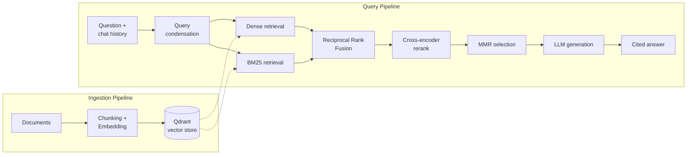

# AI Document Assistant

A Retrieval-Augmented Generation (RAG) application for asking questions across PDF, DOCX, PPTX, TXT, and Markdown documents.

The system combines **dense vector retrieval, BM25 keyword search, Reciprocal Rank Fusion, cross-encoder reranking, and Maximal Marginal Relevance (MMR)** to retrieve relevant context before generating an answer. It also supports multi-turn conversations by rewriting follow-up questions into standalone queries and provides citations back to the source document and page or slide.


> Runs locally with Python or Docker. See [Getting Started](#getting-started).

---

## Key Features

* **Hybrid retrieval** — combines dense vector search with BM25 keyword search using Reciprocal Rank Fusion (RRF).
* **Cross-encoder reranking** — re-scores retrieved candidates using query-aware relevance scoring.
* **MMR context selection** — balances relevance and diversity to reduce redundant context.
* **Conversational query rewriting** — converts follow-up questions into standalone queries before retrieval.
* **Grounded answers with citations** — generated answers reference the specific source file and page or slide used as evidence.
* **Incremental indexing** — deterministic chunk IDs make re-indexing idempotent and avoid unnecessary re-embedding.
* **Session-scoped document isolation** — uploaded documents are only queryable by the session that uploaded them, using Qdrant payload filtering rather than a separate per-user database.
* **Content-based document detection** — files are dispatched using their detected MIME type rather than relying only on file extensions.
* **Resilient external calls** — API calls use exponential-backoff retries, with a secondary LLM API key available for failover.
* **Background indexing** — document processing runs asynchronously so large uploads do not block the web request.
* **Session-based conversation memory** — Redis stores conversation history using a sliding TTL.
* **Observability** — Logfire provides structured spans across ingestion, retrieval, and generation.

---

## Why This Project?

A basic RAG pipeline can often be summarized as:

```text
Document → Chunks → Embeddings → Vector Search → LLM
```

While this works for simple use cases, a single retrieval strategy can struggle with exact terms, ambiguous follow-up questions, irrelevant results, and redundant context.

This project treats **retrieval as a multi-stage pipeline**:



The goal is to improve the quality of the context supplied to the LLM rather than relying on generation alone. See the [Architecture](#architecture) section below for each pipeline broken out in detail.

---

## Architecture

The application consists of two main pipelines: **document ingestion** and **query processing**.

### Ingestion Pipeline

```text
                    ┌──────────────────────┐
                    │      Documents       │
                    └──────────┬───────────┘
                               │
                         Ingestion
                               │
                    ┌──────────▼───────────┐
                    │ Chunking + Embedding │
                    └──────────┬───────────┘
                               │
                         Qdrant Store
```

When a document is uploaded:

1. The application detects its actual MIME type.
2. The appropriate document loader extracts its content.
3. The extracted content is validated.
4. The document is split into overlapping chunks.
5. Each chunk is embedded.
6. A deterministic ID is generated from the source information and chunk content.
7. The chunk and its metadata (including the uploading session's ID) are stored in Qdrant.

The deterministic IDs make repeated indexing idempotent and allow unchanged content to be skipped or overwritten consistently.

### Query Pipeline

```text
Question + Chat History
          │
          ▼
┌─────────────────────┐
│ Query Condensation  │
└──────────┬──────────┘
           │
      ┌────┴─────┐
      ▼          ▼
   Dense        BM25
  Retrieval    Retrieval
      │          │
      └────┬─────┘
           ▼
    Reciprocal Rank
        Fusion
           │
           ▼
  Cross-Encoder Rerank
           │
           ▼
       MMR Selection
           │
           ▼
      LLM Generation
           │
           ▼
   Cited Answer
```

For each question:

1. Conversation history is used to rewrite follow-up questions into standalone queries when necessary.
2. The standalone query is sent to both dense and BM25 retrieval, scoped to the requesting session's own documents plus any public (session-less) content.
3. The two ranked result lists are combined using Reciprocal Rank Fusion.
4. A cross-encoder reranks the merged candidates.
5. MMR selects a diverse subset of the highest-quality candidates.
6. The selected context is passed to the LLM.
7. The generated answer is parsed for citation markers and presented with the corresponding sources.

---

## How Retrieval Works

### 1. Query Condensation

Multi-turn conversations can produce queries that are incomplete on their own.

For example:

> "What about the second one?"

does not provide enough information for retrieval by itself.

If conversation history is available, the application uses an LLM to rewrite the question into a standalone query such as:

> "What does the second document say about X?"

The rewritten query is then used for retrieval.

For the first question in a conversation, condensation is skipped because there is no previous context to resolve.

---

### 2. Hybrid Retrieval

The application uses two complementary retrieval strategies.

#### Dense Retrieval

The query is embedded and searched against document embeddings stored in Qdrant.

This is useful when the query and relevant passage use different wording but express a similar meaning.

#### BM25 Retrieval

BM25 performs keyword-based retrieval using the document corpus obtained from Qdrant.

This is particularly useful for exact terms such as:

* Names
* IDs
* Acronyms
* Technical terms
* Other uncommon keywords

Dense and keyword retrieval therefore complement each other: semantic search handles meaning, while BM25 preserves exact-term matching.

---

### 3. Reciprocal Rank Fusion

Dense retrieval and BM25 produce different types of scores, so their raw scores are not directly comparable.

Instead of trying to combine those scores directly, the application combines the **rankings** produced by both retrieval methods.

For a result at rank `r`, the RRF contribution is:

```text
1 / (k + r)
```

Results appearing highly in both rankings therefore receive stronger combined rankings.

This provides a simple way to merge heterogeneous retrieval systems without requiring their score distributions to be calibrated to one another.

---

### 4. Cross-Encoder Reranking

After fusion, only a relatively small candidate set is passed to the cross-encoder:

```text
cross-encoder/ms-marco-MiniLM-L-6-v2
```

Unlike embedding-based retrieval, the cross-encoder processes the **query and passage together** and produces a relevance score for that specific pair.

This makes it suitable for fine-grained ranking of a small candidate set, while avoiding the computational cost of applying it to the entire document collection.

The application also applies a minimum reranking-score threshold. If the best retrieved context does not meet the threshold, the system avoids generating an answer from weak evidence.

---

### 5. Maximal Marginal Relevance

The reranked candidates may still contain several highly similar chunks.

MMR addresses this by balancing:

* relevance to the query
* similarity to already-selected chunks

This prevents the final context from being dominated by several near-duplicate passages.

The result is a smaller and more diverse context set for the LLM.

---

### 6. Grounded Generation

The selected chunks are numbered before being passed to the LLM.

The model is instructed to:

* answer using the provided context
* cite supporting passages using `[n]` markers
* explicitly indicate when the supplied context does not contain the answer

The application then extracts the citation markers from the generated response and displays the corresponding document sources.

---

## Example

The following example uses a set of text-mining course notes indexed through the application.

### Question

> What topics are covered in the uploaded documents?

### Answer

The uploaded material covers several areas of text mining and information retrieval, including:

* **Topic modelling and classification** — including Latent Dirichlet Allocation (LDA) and topic assignment.
* **Recommender and information-filtering systems** — including ranking and relevance scoring.
* **Text summarisation** — including extractive and abstractive approaches and evaluation.
* **Exploratory text analysis** — including lexical, syntactic, and semantic challenges.
* **Information retrieval** — including metadata, Boolean operators, binary relevance, and inverted indexes.

Each `[n]` citation in the generated response corresponds to a source entry containing the document name and page or slide number.

---

## Design Decisions

### Deterministic Chunk IDs

Instead of assigning random UUIDs to chunks, the application generates deterministic IDs from source information, position, and content.

This means:

* unchanged chunks receive the same ID when re-indexed
* existing records can be updated without creating duplicates
* modified chunks receive different IDs
* incremental indexing does not require reprocessing the entire corpus

---

### MIME Detection Instead of File Extensions

The application uses `python-magic` to determine the actual MIME type of an uploaded file.

This prevents a renamed or incorrectly labelled file from being silently routed to an inappropriate parser.

Supported formats include:

* PDF
* DOCX
* PPTX
* TXT
* Markdown

---

### Retry and LLM Failover

External API calls use exponential-backoff retries through `tenacity`.

LLM generation additionally supports a secondary Groq API key. If the primary key continues to fail after retries, the application can fall back to the secondary key.

This provides resilience against temporary API failures or rate limits.

---

### Sliding Redis Session TTL

Conversation history is stored in Redis using a sliding expiration window.

Each new conversation turn refreshes the session's TTL. Active conversations therefore remain available, while inactive sessions eventually expire automatically.

---

### Background Indexing

Document processing can involve:

* parsing
* validation
* chunking
* embedding
* vector-store updates

These operations run as a FastAPI background task after the upload request is accepted.

The UI polls the indexing status rather than keeping the upload request open for the entire operation.

---

### Predictable Retrieval Output

MMR intentionally changes the ordering of candidates to improve diversity.

Before returning the final retrieval results to downstream components, the application re-sorts them by relevance score so consumers can consistently treat the highest-scoring result as the first result.

---

### Session-Scoped Document Isolation

Each chunk is tagged with the uploading session's ID. Retrieval filters results to that session's own uploads plus any content with no session ID at all (public or CLI-indexed content), using a Qdrant `should`/`IsEmpty` filter rather than a strict equality match — a strict match would also hide the public content from every session.

Filtering within a single collection is Qdrant's recommended approach to multi-tenancy. A separate collection per user would not scale as well and would also require a separate BM25 index per user instead of one shared, cached index.

This is session-cookie-based isolation, not full account-based authentication: a fresh browser session sees no documents until it uploads its own, but there is no login and no access to the same documents from another device or browser (see [Limitations](#limitations)).

---

## Tech Stack

| Layer                  | Technology                            | Purpose                                   |
| ---------------------- | ------------------------------------- | ----------------------------------------- |
| Language               | Python 3.12+                          | Application and RAG pipeline              |
| Web framework          | FastAPI                               | API and web application backend           |
| Templates/UI           | Jinja2 + HTMX                         | Server-rendered interactive interface     |
| LLM                    | Groq (`openai/gpt-oss-120b`)          | Query condensation and answer generation  |
| Embeddings             | Hugging Face `BAAI/bge-small-en-v1.5` | Local document and query embeddings       |
| Alternative embeddings | Gemini                                | Configurable API-based embedding provider |
| Vector database        | Qdrant                                | Vector storage and similarity retrieval   |
| Keyword retrieval      | `rank_bm25`                           | BM25 keyword search                       |
| Reranking              | `sentence-transformers`               | Cross-encoder relevance scoring           |
| Session memory         | Redis                                 | Conversation history with TTL             |
| PDF parsing            | `pdfplumber`                          | PDF text extraction                       |
| DOCX parsing           | `docx2txt`                            | Word document extraction                  |
| PPTX parsing           | `python-pptx`                         | PowerPoint extraction                     |
| MIME detection         | `python-magic`                        | Content-based file-type detection         |
| Observability          | Logfire                               | Structured application tracing. Local runs auto-detect credentials from `logfire auth`; Docker runs need `LOGFIRE_TOKEN` in `.env` instead, since the local credentials file isn't available inside a container |
| Resilience             | `tenacity`                            | Retry and exponential backoff             |
| Containerization       | Docker                                | Reproducible application deployment       |

---

## Project Structure

```text
app/
├── config.py                  # Application configuration
├── models.py                  # Embedding and LLM client construction
│
├── indexing/
│   ├── document_loader/       # MIME detection and document loaders
│   ├── chunking/              # Document chunking
│   └── pipeline.py            # Ingestion and indexing orchestration
│
├── vectorstore/
│   ├── client.py              # Qdrant client and collection setup
│   ├── indexer.py             # Embedding and vector upserts
│   └── ids.py                 # Deterministic chunk IDs
│
├── retrieval/
│   ├── retriever.py           # Retrieval pipeline orchestration
│   ├── fusion.py               # RRF and MMR
│   ├── bm25_index.py           # In-memory BM25 index
│   └── reranker.py             # Cross-encoder reranking
│
├── generation/
│   ├── query_condenser.py     # Follow-up question rewriting
│   └── generator.py            # Context construction and answer generation
│
└── web/
    ├── main.py                # FastAPI application
    ├── routes/                # Upload, chat, and status endpoints
    ├── memory.py              # Redis-backed conversation memory
    ├── templates/              # Jinja2 templates
    └── static/                 # HTMX UI and static assets (CSS, JS)
```

---

## Getting Started

### Prerequisites

You can run the application using either a local Python environment or Docker.

You will need:

* Python 3.12+ for the virtual-environment setup
* A Qdrant instance
* A Redis instance
* A Groq API key
* An embedding provider

The default Hugging Face embedding model runs locally and does not require an API key. Gemini can also be configured as an alternative embedding provider.

### 1. Clone the Repository

```bash
git clone https://github.com/khannoaman/ai-document-assistant.git
cd ai-document-assistant
```

### 2. Configure Environment Variables

Create the environment file:

```bash
cp .env.example .env
```

Configure the required values in `.env`, including:

* Qdrant endpoint and credentials
* Redis URL
* Groq API key
* Optional secondary Groq API key
* Embedding provider configuration
* Optional `LOGFIRE_TOKEN`, if sending observability data to Logfire (required for Docker runs specifically; see [Tech Stack](#tech-stack))

The default Redis URL is:

```text
redis://localhost:6379/0
```

---

### Option A: Run with Python

Create and activate a virtual environment:

```bash
python3 -m venv venv
source venv/bin/activate
```

Install dependencies:

```bash
pip install -r requirements.txt
```

Start the application:

```bash
uvicorn app.web.main:app --reload --port 8010
```

Then open:

```text
http://localhost:8010
```

---

### Option B: Run with Docker

Build the image:

```bash
docker build -t ai-document-assistant .
```

Run the application:

```bash
docker run --rm \
  -p 8010:8010 \
  --env-file .env \
  -v "$(pwd)/data:/app/data" \
  ai-document-assistant
```

The embedding and reranker models are downloaded from Hugging Face on first startup, so the initial model load may take longer than subsequent requests.

---

## Usage

### Web Application

The primary workflow is:

1. Open the web application.
2. Upload one or more supported documents.
3. Wait for indexing to complete.
4. Ask a question in the chat interface.
5. Review the generated answer and its source citations.
6. Continue with follow-up questions using the same conversation.

Uploaded documents are only visible within the browser session that uploaded them; a different session (or a cleared-cookie visit) won't see them.

### Bulk Indexing

For local development, documents can also be placed in the `data/` directory and indexed through the CLI:

```bash
python -m app.indexing.pipeline
```

When running inside Docker:

```bash
docker exec <container> python -m app.indexing.pipeline
```

Documents indexed this way have no session owner and are treated as public content, visible to every session.

### Retrieval Debugging

The retrieval pipeline can be tested independently of answer generation:

```bash
python -m app.retrieval.retriever \
  "what were the main findings?" \
  --k 5
```

The generation pipeline can also be tested with conversation history:

```bash
python -m app.generation.generator \
  "what about the second one?" \
  --history "what did chapter 3 cover?::Chapter 3 covered feature engineering and..."
```

---

## Configuration

The main configuration options are defined in `app/config.py` and can be overridden through `.env`.

| Setting               |       Default | Description                                                     |
| --------------------- | ------------: | --------------------------------------------------------------- |
| `CHUNK_SIZE`          |         `800` | Target chunk size                                               |
| `CHUNK_OVERLAP`       |         `100` | Overlap between adjacent chunks                                 |
| `RETRIEVAL_TOP_K`     |           `5` | Number of final chunks passed to the LLM                        |
| `RETRIEVAL_FETCH_K`   |          `20` | Candidates retrieved from each retrieval method                 |
| `RERANK_TOP_N`        |          `10` | Candidates retained after reranking                             |
| `MMR_LAMBDA`          |         `0.5` | Relevance/diversity trade-off for MMR                           |
| `MIN_RERANK_SCORE`    |        `-4.0` | Minimum cross-encoder score required to generate an answer      |
| `MAX_MEMORY_TURNS`    |           `5` | Number of previous conversation turns supplied to the condenser |
| `SESSION_TTL_SECONDS` |        `1800` | Redis session expiration time                                   |
| `EMBEDDING_PROVIDER`  | `huggingface` | `huggingface` or `gemini`                                       |

For MMR:

```text
0 → prioritize diversity
1 → prioritize relevance
```

---

## Limitations

The current implementation has several known limitations:

* **Session-scoped, not account-scoped, isolation** — documents are private to the anonymous browser session that uploaded them, not a real user account. There is no login, so clearing cookies or switching browsers loses access to previously uploaded documents, and there is no way to reach the same documents from another device.
* **No automatic document expiry** — unlike chat history, which has a Redis TTL, a session's uploaded document chunks remain in Qdrant indefinitely after the session itself expires, rather than being cleaned up automatically.
* **No automated retrieval evaluation** — retrieval parameters are currently tuned qualitatively rather than against a labelled evaluation dataset.
* **No OCR support** — scanned or image-only PDFs are not currently supported.
* **In-memory BM25 index** — the BM25 index is built from Qdrant data when first required and is maintained in memory per process. A persistent/shared index would be more appropriate for larger multi-instance deployments.
* **No streaming responses** — the complete LLM response is returned after generation rather than streamed token-by-token.

---

## Roadmap

* [ ] Add automatic cleanup for orphaned session-scoped documents — a periodic sweep comparing Qdrant's stored session IDs against active Redis sessions, removing chunks whose session has expired
* [ ] Add persistent user accounts, so uploaded documents follow a login across devices/browsers instead of a single anonymous session cookie
* [ ] Add a retrieval evaluation harness with a labelled Q&A dataset
* [ ] Evaluate retrieval using metrics such as Precision@K, Recall@K, and MRR
* [ ] Add OCR support for scanned documents
* [ ] Add streaming LLM responses
* [ ] Improve BM25 indexing for multi-instance deployments

---

## Summary

This project demonstrates a multi-stage RAG architecture designed around **retrieval quality, grounded generation, and session-scoped document isolation**.

The core pipeline combines chunking and embedding, hybrid dense/BM25 retrieval, Reciprocal Rank Fusion, cross-encoder reranking, and MMR context selection before an answer is generated and returned with citations (see the [pipeline diagram](#why-this-project) above).

The project combines retrieval, ranking, conversational context handling, per-session document isolation, resilience, observability, and document processing into a single application that can be run locally or through Docker.
