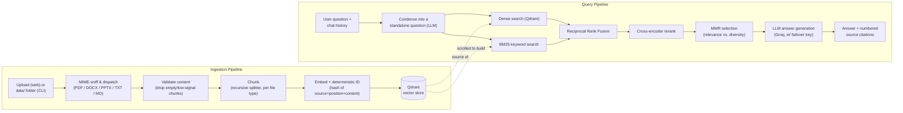

# AI Document Assistant

A RAG-based Q&A system that lets you upload PDF, DOCX, PPTX, TXT, and Markdown documents, then ask questions in natural language and get answers grounded in — and cited to — the actual source documents.

Built to go past the "stuff everything into one vector search" version of RAG: it fuses dense and keyword retrieval, reranks with a cross-encoder, balances relevance against redundancy, and keeps multi-turn conversations coherent by rewriting follow-up questions before retrieval ever runs. The goal was to treat retrieval quality as a first-class engineering problem, not just an LLM prompting problem.


> Runs locally in a few minutes — see [Getting Started](#getting-started).

## Key Highlights

- **Hybrid retrieval** — dense vector search (Qdrant) fused with BM25 keyword search via Reciprocal Rank Fusion
- **Cross-encoder reranking** — query-aware relevance scoring on top of the fused candidates, with a confidence gate that refuses to answer from weak context
- **MMR context selection** — trims redundant chunks before they reach the LLM
- **Conversational query rewriting** — follow-up questions are condensed into standalone queries before retrieval
- **Grounded generation with citations** — every answer traces back to a specific file and page/slide
- **Incremental indexing** — deterministic chunk IDs make re-indexing idempotent; uploads only re-embed what's new
- **Resilient external calls** — retry with backoff on every LLM/embedding call, plus LLM key failover
- **Observability built in** — structured Logfire spans across ingestion, retrieval, and generation

## Table of Contents

- [Overview](#overview)
- [Architecture](#architecture)
- [How a Query Actually Works](#how-a-query-actually-works)
- [Example](#example)
- [Design Decisions](#design-decisions)
- [Tech Stack](#tech-stack)
- [Project Structure](#project-structure)
- [Getting Started](#getting-started)
- [Usage](#usage)
- [Configuration](#configuration)
- [Known Limitations](#known-limitations)
- [Roadmap](#roadmap)

## Overview

Upload documents through the web UI, and it will:

1. **Ingest** — detect each file's real type (not just its extension), extract text with a loader suited to that format, validate content, and split it into overlapping chunks.
2. **Index** — embed each chunk and store it in a vector database. A BM25 keyword index is also derived from that same store (built lazily in-process on first query, cached after) for exact-term matching.
3. **Answer** — given a question, retrieve candidates from both indexes, fuse and rerank them, and pass only the most relevant, non-redundant context to an LLM that answers with inline `[n]` citations back to the source file and page/slide.

The web app also remembers conversation history per browser session (Redis-backed, cookie-based), so follow-up questions like "what about the second one?" resolve correctly.

## Architecture

At a glance: documents get chunked and embedded into Qdrant once; every question then runs through condensation → hybrid retrieval → fusion → reranking → diversity selection → generation before an answer comes back with citations.



Everything above the vector store runs synchronously in a FastAPI request; indexing runs as a background task so an upload doesn't block the UI.

## How a Query Actually Works

This is the part worth being able to explain in detail:

1. **Query condensation.** If there's chat history, an LLM call rewrites the follow-up ("what about that one?") into a standalone question ("what does the second thesis chapter say about X?"). Retrieval only ever sees standalone questions — this keeps embedding search from being confused by pronouns it can't resolve. Skipped entirely on the first turn of a conversation to save a round trip.
2. **Hybrid candidate retrieval.** The standalone question hits two independent retrievers in parallel: a dense vector search (Qdrant, cosine similarity) and a BM25 keyword search built from the same corpus. Dense retrieval finds semantically related passages even without shared words; BM25 catches exact terms (IDs, names, acronyms) that embeddings can blur together.
3. **Reciprocal Rank Fusion (RRF).** Cosine similarity and BM25 scores live on incomparable scales, so instead of trying to normalize and average them, each candidate is scored by `1 / (k + rank)` in its own list and the two lists are merged by that. Rank-based fusion is simpler and more robust than score normalization heuristics.
4. **Cross-encoder reranking.** The fused pool (default: top 20 per method) is re-scored by a `cross-encoder/ms-marco-MiniLM-L-6-v2` model that reads the *query and passage together*, which is far more accurate than comparing independently-computed embeddings — at the cost of being too slow to run over the whole corpus, hence why it only runs on the already-narrowed candidate pool. This score also gates the response: if the best-reranked score falls below a threshold, the app answers "I don't have relevant information" instead of forcing an answer from weak context.
5. **MMR selection.** The top reranked candidates still get filtered down to the final `k` using Maximal Marginal Relevance, which trades off pure relevance against redundancy — so five chunks that all restate the same sentence don't crowd out a genuinely different relevant passage.
6. **Grounded generation.** The final context is numbered and handed to the LLM with an explicit instruction to cite `[n]` markers and to say when it doesn't know. The app then parses those citation markers back out of the answer so the UI only displays sources the model actually used.

## Example

An actual run against a folder of text-mining course notes indexed through the app:

**Q: What topics are covered in the uploaded documents?**

> The uploaded material is a textbook-style overview of text-mining and related information-retrieval techniques. Across the five pages the following subjects are discussed:
>
> - **Topic modelling and classification** — Latent Dirichlet Allocation (LDA), Dirichlet distributions, and the use of rule-based or machine-learning systems to assign topics to documents [1].
> - **Recommender and information-filtering systems** — ranking, relevance scoring, and the need to suggest both known and unknown items to users [2].
> - **Summarisation** — the distinction between extractive and abstractive summarisation, human judgments, and extrinsic evaluation metrics [3].
> - **Exploratory analysis and the fundamentals of text mining** — handling unstructured text, dealing with lexical, syntactic and semantic ambiguities, and the overall goals of discovering useful patterns [4].
> - **Information retrieval basics** — metadata, Boolean query operators (AND, OR, NOT), binary relevance, and the inverted index representation used by web search engines [5].

Each `[n]` in the actual UI is a clickable citation back to the source file and page.

## Design Decisions

A few choices that weren't the "obvious" first pass, and why:

- **Deterministic chunk IDs, not random UUIDs.** Each chunk's vector store ID is a hash of `(file_path, page/slide position, content)`. Re-indexing the same unchanged file is idempotent — it overwrites the same points instead of duplicating them — while a genuinely edited chunk gets a new ID so stale content doesn't linger. This is also what makes incremental, upload-triggered indexing safe: only the newly uploaded files are re-embedded, not the whole corpus.
- **MIME sniffing over trusting file extensions.** Files are dispatched to a loader by inspecting actual content (`python-magic`), not the filename, since a mislabeled or renamed file shouldn't silently skip validation or hit the wrong parser.
- **A hand-rolled PPTX loader instead of `UnstructuredPowerPointLoader`.** LangChain's Unstructured-based loaders pull in `numba`/`llvmlite` as transitive dependencies for a feature (layout-aware parsing) this project doesn't need — slides are extracted directly with `python-pptx` instead, trading some structure-awareness for a much lighter dependency tree.
- **LLM calls have retry + failover, embeddings have retry.** Every Groq/embedding call is wrapped with exponential backoff (`tenacity`), and chat generation additionally fails over to a secondary Groq API key if the primary's retries are exhausted — a rate-limited key degrades the app instead of taking it down.
- **Redis session memory is a sliding TTL, not a hard expiry.** Every turn re-sets the same key with a fresh TTL, so an active conversation never expires mid-use, but an abandoned one is cleaned up automatically rather than growing Redis memory forever.
- **Background indexing + polling, not a blocking upload request.** Uploads return immediately; the actual chunk/embed/index work runs in a FastAPI background task while the UI polls `/status`. Embedding a large PDF shouldn't hang the request.
- **The final retrieval result is re-sorted by score before being returned.** MMR intentionally reorders for diversity, not pure relevance — but callers (like the "no relevant context" gate in generation) need a reliable "best match first" contract, so retrieval re-sorts once at the boundary rather than every caller re-deriving it.

## Tech Stack

| Layer | Choice | Why |
|---|---|---|
| Language | Python 3.12+ | Best-supported ecosystem for both the LLM/RAG tooling and the document-parsing libraries involved |
| Web framework | FastAPI + Jinja2 + HTMX | Server-rendered partials over a JS framework — small surface area, no client-side state to sync |
| LLM | Groq (`openai/gpt-oss-120b`, configurable) | Fast inference; wrapped with retry + secondary-key failover |
| Embeddings | HuggingFace `BAAI/bge-small-en-v1.5` (default) or Gemini | Swappable via config; local model avoids per-call embedding cost during development |
| Vector store | Qdrant | Native payload filtering + hybrid-friendly (raw points scroll for BM25 corpus building) |
| Keyword search | `rank_bm25` (BM25Okapi) | In-process, no separate search infra needed for this scale |
| Reranking | `sentence-transformers` cross-encoder | Query-aware relevance scoring beyond cosine similarity |
| Session memory | Redis | Sliding-TTL chat history, shared cookie-based session id |
| Document parsing | `pdfplumber` (PDF), `docx2txt` (DOCX), `python-pptx` (PPTX), `python-magic` (MIME dispatch) | Format-specific extraction dispatched by real content type, not file extension |
| Observability | Logfire | Structured spans across ingestion, retrieval, and generation |
| Resilience | `tenacity` | Exponential-backoff retries on external API calls |

## Project Structure

```
app/
├── config.py                  # pydantic-settings: every tunable in one place
├── models.py                  # embedding model + LLM client construction (retry/failover)
├── indexing/
│   ├── document_loader/       # MIME detection → per-format loaders → validation → metadata normalization
│   ├── chunking/               # recursive text splitting (markdown-aware)
│   └── pipeline.py             # orchestrates load → chunk → index (full corpus or a file subset)
├── vectorstore/
│   ├── client.py                # Qdrant client + collection bootstrap
│   ├── indexer.py               # embeds + upserts chunks
│   └── ids.py                   # deterministic point-id hashing
├── retrieval/
│   ├── retriever.py              # orchestrates hybrid retrieve → fuse → rerank → MMR
│   ├── fusion.py                 # Reciprocal Rank Fusion + MMR selection
│   ├── bm25_index.py             # in-memory BM25 index built from Qdrant's own payloads
│   └── reranker.py               # cross-encoder scoring
├── generation/
│   ├── query_condenser.py        # rewrites follow-ups into standalone questions
│   └── generator.py               # builds cited context, calls the LLM, parses citations
└── web/
    ├── main.py, routes/           # FastAPI app: upload, chat, status endpoints
    ├── memory.py                   # Redis-backed session chat history
    └── templates/, static/          # HTMX-driven UI (dropzone upload, live chat log)
```

## Getting Started

### Prerequisites

- Python 3.12+
- A [Qdrant](https://qdrant.tech/) instance — the free tier of [Qdrant Cloud](https://cloud.qdrant.io/) works fine
- A Redis instance for chat session memory, pointed to via `REDIS_URL` — a hosted free tier ([Redis Cloud](https://redis.io/cloud/), Upstash) or a local one (`brew install redis` / `docker run -p 6379:6379 redis`) both work
- At least one LLM key ([Groq](https://console.groq.com/)) and one embedding provider configured (HuggingFace runs locally with no key; Gemini needs a Google API key)

### Install

```bash
git clone https://github.com/<your-username>/ai-document-assistant.git
cd ai-document-assistant
python3 -m venv venv
source venv/bin/activate
pip install -r requirements.txt
```

### Configure

```bash
cp .env.example .env
```

Fill in `.env` with your Qdrant endpoint/key, Redis URL, Groq API key, and (optionally) a fallback Groq key. `REDIS_URL` defaults to `redis://localhost:6379/0`; point it at a hosted Redis instead if you're not running one locally. All other settings have working defaults — see [Configuration](#configuration).

### Run

```bash
uvicorn app.web.main:app --reload --port 8010
```

Open `http://localhost:8010`, upload documents through the UI, and start asking questions — each upload is indexed incrementally, without re-processing the whole corpus.

## Usage

**Web UI** (how an end user interacts with it) — drag files onto the dropzone, wait for the status badge to read "done," then ask questions in the chat box. The full answer is returned once generation finishes (not token-streamed — see [Roadmap](#roadmap)), with clickable source citations.

**Bulk/local indexing via CLI** — useful when developing locally with a large batch of files already on disk: drop them into `data/` and run `python -m app.indexing.pipeline` instead of uploading one by one through the browser. Not part of the deployed user-facing flow.

**Retrieval/generation CLI**, useful for debugging retrieval quality directly without the LLM in the loop:

```bash
# Inspect what the retriever actually returns for a query
python -m app.retrieval.retriever "what were the main findings?" --k 5

# Full RAG answer, optionally with conversation history for testing condensation
python -m app.generation.generator "what about the second one?" \
  --history "what did chapter 3 cover?::Chapter 3 covered feature engineering and..."
```

## Configuration

All tunables live in [`app/config.py`](app/config.py) and can be overridden via `.env`. The ones most worth understanding:

| Setting | Default | Effect |
|---|---|---|
| `CHUNK_SIZE` / `CHUNK_OVERLAP` | 800 / 100 | Chunk granularity — smaller chunks improve precision, larger ones preserve more context per citation |
| `RETRIEVAL_TOP_K` | 5 | Final number of chunks passed to the LLM |
| `RETRIEVAL_FETCH_K` | 20 | Candidates pulled from *each* retriever (dense, BM25) before fusion |
| `RERANK_TOP_N` | 10 | Candidates kept after reranking, before MMR narrows to `top_k` |
| `MMR_LAMBDA` | 0.5 | 0 = maximize diversity, 1 = maximize pure relevance |
| `MIN_RERANK_SCORE` | -4.0 | Cross-encoder logit floor — below this, the app refuses to answer rather than guess from weak context |
| `MAX_MEMORY_TURNS` | 5 | Prior conversation turns retained and fed to the condenser |
| `SESSION_TTL_SECONDS` | 1800 | Sliding Redis expiry for chat sessions |
| `EMBEDDING_PROVIDER` | `huggingface` | `huggingface` (local, free) or `gemini` (API-based) |

## Known Limitations

Being upfront about what this doesn't do (yet):

- **Single collection, no multi-tenant document isolation** — every uploaded document is queryable by anyone using the app. Not suitable for a public multi-user deployment without adding auth and per-user document scoping first.
- No automated retrieval-quality evaluation harness — tuning `RETRIEVAL_FETCH_K`, `MMR_LAMBDA`, etc. is currently manual/qualitative, not benchmarked against a labeled question set.
- No automated tests.
- Scanned/image-only PDFs aren't OCR'd — they're skipped by the low-content validator, not silently mishandled, but also not supported.
- BM25 index is rebuilt in-memory per process from a full Qdrant scroll on first use; fine at this scale, would need a persistent/shared index for multi-instance deployment.

## Roadmap

- [ ] Deploy a public live demo
- [ ] Retrieval evaluation harness (labeled Q&A set + precision/recall metrics) to justify pipeline tuning with numbers instead of intuition
- [ ] Automated tests around chunking, ID determinism, and the retrieval fusion logic
- [ ] Streaming LLM responses instead of full-response wait
